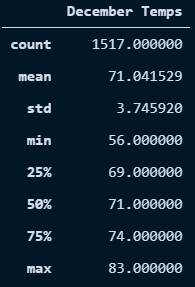

# Surfs Up with Advanced Data Storage and Retrieval

## Overview 

This project focused on a statistical analysis of weather in Oahu to determine the viability of opening and maintaining a Surf and Shake shop in the area.

### Purpose

In order to receive investor backing for our Surf and Shake shop idea, we worked with investor W. Avy to produce statistical analyses on the weather in Oahu. Initially, we were concerned with the possibility the shop would be rained out of business, but our work in climate_analysis.ipynb suggested that, while rain is a frequent occurence in Oahu, it isn't sustained enough to greatly impact business. 

However, this report focuses on the results of our final analysis: the difference in temperatures between the months of June and December, which we performed to ensure the viability of the business throughout the year.

## Results

### Summary Statistics

Below are the summary statistics for temperature during June and December:

Of note, there are about 200 more observations for the month of June than for December, which may the data for December slightly less reliable than for June. Despite this, there is still plenty of data for December, but we should keep this in mind as we interpret these results.

### Analysis

From these statistics, we can notice a few differences between temperatures in June and December:

- Both the mean and median (50th percentile) temperatures for both months suggests that, on average, June is about 4 degrees hotter than December. 
- The standard deviation for December is ~.5 degrees higher than for June, suggesting that temperatures in December are spread out further on average. That is, Oahu temperatures in December are more variable than in June.
- As we would expect, December is generally colder than June on average, with half of the recorded temperatures being less than 71 degrees. As seen in the images above, this is lower than the average temperature in June, ~75 degrees. However, a quarter of recorded temperatures in December are between 69 and 71 degrees, suggesting that December does not often become so cold that it would greatly affect business.

## Summary

As noted above, there are essential differences between the temperatures in June and December. Interestingly, however, there are many similarities as well. The maximum temperature for both months is within 2 degrees of each other and the average temperature is only 4 degrees apart. While December _does_ get much colder than June (the minimum temperatures being 56 and 64 degrees, respectively), on average the temperatures seem fairly consistent between the two months. This suggests that our business won't be as affected as we initially worried. 

### Additional Queries

To ensure the success of the business, it would be prudent to perform further analyses of the weather during the months of June and December:

- A specific look at rainfall during these months would allow us to determine whether these months would be more or less rainy than the rest of the year on average and plan our business practices accordingly.
- Filtering the temperature and/or rainfall data by year as well as month would give us insight on whether the average temperature and rainfall for June and December have stayed consistent, or are trending higher or lower. This could be important information to ensure the longetivity of our business with potential changes in climate.

