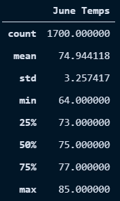

# Surfs Up with Advanced Data Storage and Retrieval

## Overview 

This project focused on a statistical analysis of weather in Oahu to determine the viability of opening and maintaining a Surf and Shake shop in the area.

### Purpose

In order to receive investor backing for our Surf and Shake shop idea, we worked with investor W. Avy to produce statistical analyses on the weather in Oahu. Initially, we were concerned with the possibility the shop would be rained out of business, but our work in climate_analysis.ipynb suggested that, while rain is a frequent occurence in Oahu, it isn't sustained enough to greatly impact business. 

However, this report focuses on the results of our final analysis: the difference in temperatures between the months of June and December, which we performed to ensure the viability of the business throughout the year.

## Results

### Summary Statistics

